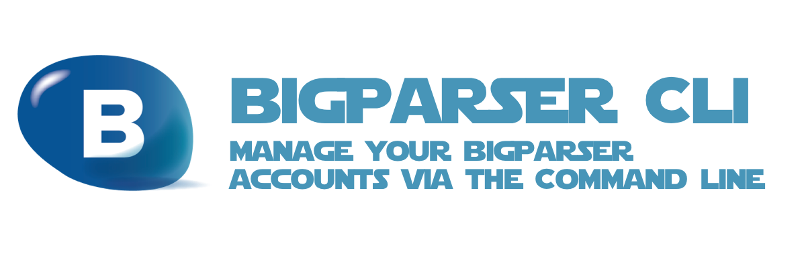

# bigparser-cli



> **THIS PROJECT IS STILL IN THE DESIGN PHASE**
>
> IDEAS & CONTRIBUTIONS ARE WELCOME
>
> An [Open Source Universe](https://github.com/intellibus/approach) Project

---

## Contents

- [bigparser-cli](#bigparser-cli)
  - [Contents](#contents)
  - [Features ✨](#features-)
  - [Install 🛠](#install-)
  - [Usage 🔭](#usage-)
  - [Documentation 🛰](#documentation-)
  - [Contributing 🌎](#contributing-)
  - [License ⚖️](#license-️)

## Features ✨

- Persist AuthId to Local Machine `Planned`
- Login via AuthId `Planned`
- Login via Email & Password `Planned`
- Login via OAuth `Planned`
- Manage Multiple BigParser Profiles `Planned`
- Define Standards for Local Storage of BigParser Credentials `Planned`
- Simple CLI Interface `Planned`
- Typescript Support `Planned`

## Install 🛠

```sh
npm install bigparser-cli
```

## Usage 🔭

Read more about the [Design](https://github.com/intellibus/bigparser-cli/blob/main/DESIGN.md) behind `bigparser-cli` here.

```text
$ bigparser login

Choose your login method:
  OAuth
  Email / Password
> AuthId

Paste your AuthId: ****-****-****-****

Enter a profile name (optional): dev

Congrats! Your BigParser Account has been saved under the dev profile

$
```

## Documentation 🛰

`bigparser-cli` *is under active development, documentation will be added once an initial release is ready.*

## Contributing 🌎

We would love for you to contribute your ideas, code, & fixes to `bigparser-cli`.

We encourage everyone to read our [Design Document](https://github.com/intellibus/bigparser-cli/blob/main/DESIGN.md) to learn more about the thought process behind bigparser-cli.

Also check out the [rewards](https://github.com/intellibus/approach/blob/main/REWARDS.md) offered for contributing to the [Open Source Universe](https://github.com/intellibus/approach).

## License ⚖️

MIT
